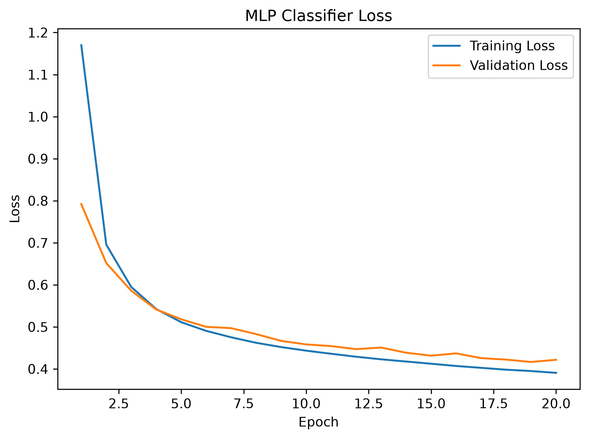
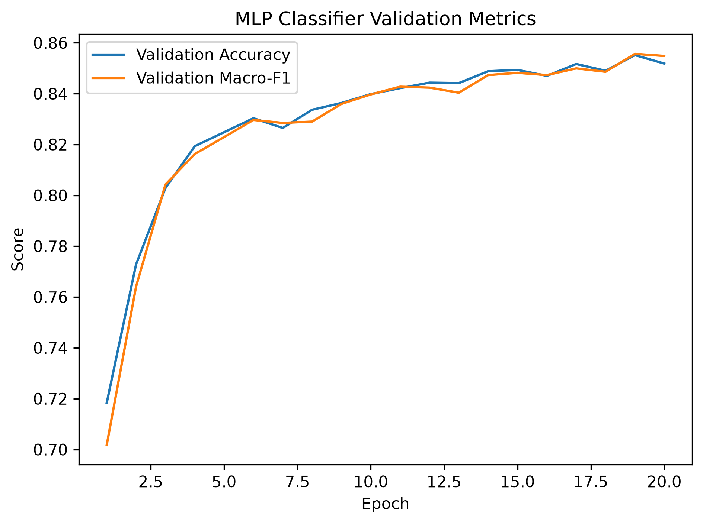
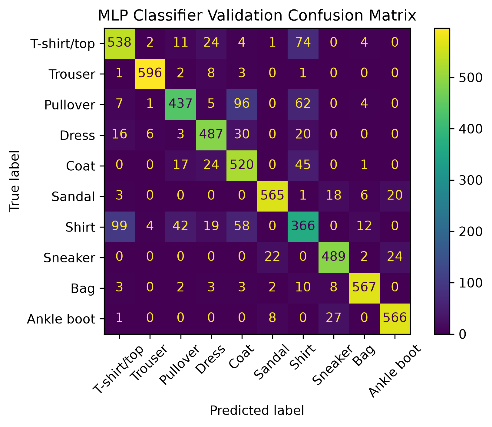
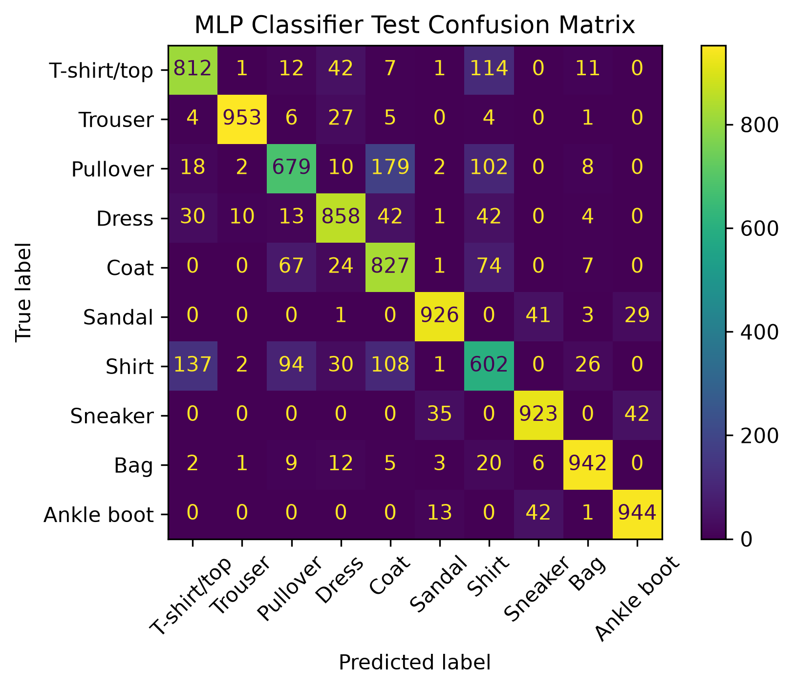

# Fashion-MNIST Classification with PyTorch
[English](README.md) | [中文](README_zh.md)

A small PyTorch image-classification project built on the Fashion-MNIST dataset.

The project compares a linear baseline with a small multilayer perceptron (MLP), uses a fixed training/validation split for model selection, and evaluates the selected model on the official test set.

The final MLP checkpoint is selected according to **validation Macro-F1**.

## Results

Final MLP results:

| Split | Accuracy | Macro-F1 |
|---|---:|---:|
| Validation | 85.52% | 85.57% |
| Test | 84.66% | 84.62% |

The best model was selected at **epoch 19** from a maximum of 20 training epochs.

### Training Loss



### Validation Metrics



### Validation Confusion Matrix



### Test Confusion Matrix



The most common classification errors are concentrated among visually similar upper-body clothing categories, especially **T-shirt/top, Pullover, Coat, and Shirt**.

## Model

The main model is a small MLP:

```text
Input image: 1 × 28 × 28
        ↓
Flatten: 784
        ↓
Linear: 784 → 128
        ↓
ReLU
        ↓
Linear: 128 → 10
        ↓
Class logits
```

A linear classifier is also included as a baseline.

## Training Setup

- Dataset: Fashion-MNIST
- Training samples: 54,000
- Validation samples: 6,000
- Test samples: 10,000
- Batch size: 64
- Optimizer: SGD
- Learning rate: 0.01
- Maximum epochs: 20
- Loss function: Cross-Entropy Loss
- Model-selection metric: Validation Macro-F1
- Random seed: 42
- Apple Silicon acceleration: PyTorch MPS when available

The official test set is isolated from the training and model-selection pipeline and is only used by the separate evaluation script.

## Project Structure

```text
pytorch_fashion_mnist/
├── main.py
├── evaluate_checkpoint.py
├── models.py
├── training.py
├── evaluation.py
├── requirements.txt
├── README.md
├── .gitignore
└── results/
    ├── mlp_training_history.json
    ├── mlp_loss_curve.png
    ├── mlp_validation_metrics.png
    ├── mlp_validation_confusion_matrix.png
    └── mlp_test_confusion_matrix.png
```

The local `data/` and `checkpoints/` directories are excluded from version control.

## Code Responsibilities

### `main.py`

Training entry point.

It:

- downloads Fashion-MNIST if necessary;
- creates a deterministic 54,000 / 6,000 train-validation split;
- trains the MLP;
- tracks validation loss, accuracy, and Macro-F1;
- restores the model from the epoch with the best validation Macro-F1;
- saves the best checkpoint;
- saves the training history as JSON.

### `evaluate_checkpoint.py`

Evaluation and visualization entry point.

It:

- loads the saved training history;
- restores the corresponding best checkpoint;
- recreates the same validation split;
- evaluates the model on validation and test sets;
- produces classification reports;
- identifies the most common misclassification directions;
- generates confusion matrices and training curves.

### `models.py`

Defines:

- `LinearClassifier`
- `MLPClassifier`

### `training.py`

Contains the reusable training and validation loop, including best-model selection.

### `evaluation.py`

Contains reusable evaluation and misclassification-analysis functions.

## Installation

Python 3.11 is recommended.

Create and activate a Python environment, then install the dependencies:

```bash
pip install -r requirements.txt
```

Dependencies used in the verified development environment:

```text
torch==2.14.0
torchvision==0.29.0
scikit-learn==1.9.1
matplotlib==3.11.2
```

## Usage

### 1. Train the model

Run:

```bash
python main.py
```

This will:

1. download Fashion-MNIST if it is not already available;
2. train the MLP;
3. select the best epoch using validation Macro-F1;
4. save the checkpoint under `checkpoints/`;
5. save the training history under `results/`.

### 2. Evaluate the saved model

After training has completed, run:

```bash
python evaluate_checkpoint.py
```

This script does **not** automatically download the dataset and expects the data and checkpoint produced during training to already exist locally.

It evaluates the selected model and regenerates the result figures in `results/`.

## Error Analysis

For the selected model, the most frequent validation misclassifications were:

```text
Shirt -> T-shirt/top : 99
Pullover -> Coat     : 96
T-shirt/top -> Shirt : 74
Pullover -> Shirt    : 62
Shirt -> Coat        : 58
```

The most frequent test misclassifications were:

```text
Pullover -> Coat     : 179
Shirt -> T-shirt/top : 137
T-shirt/top -> Shirt : 114
Shirt -> Coat        : 108
Pullover -> Shirt    : 102
```

The similarity between validation and test error patterns suggests that the main limitation of this MLP is fine-grained discrimination among visually similar upper-body clothing categories.

## Reproducibility

The experiment uses deterministic seeds for:

- the train-validation split;
- training-data shuffling;
- model initialization.

The training history records the complete 20-epoch trajectory and the selected best epoch.

The current recorded experiment selected:

```text
Best epoch: 19
Validation accuracy: 0.8551666667
Validation Macro-F1: 0.8556532774
Test accuracy: 0.8466
Test Macro-F1: 0.8462483930
```